# 알고리즘 고급

## 코딩 테스트

- IT기업 취업 시 면접 전형 중 포함된 면접자 프로그래밍 스킬 파악을 위한코딩 테스트
- CBT(Computer Based Test) 방식으로 진행
- 주관식. 소스코드를 작성해서 제출
- 대깁업, 일부 코스닥 상장 기업, 알고리즘이 아주 중요한 IT기업 등에서 진행
- 네(이버)/카(카오)/라(인)/쿠(팡)/배(달의 민족) 기업들이 주요 코딩 테스트 전형 업체
- 네(이버)/카(카오)/삼(성)/토(스)/배(달의 민족)

## 코딩 테스트 환경 설정

코딩 데스트 합격자괴기 C++ 진행

### VC++ 17 설정

[링크](https://github.com/dremdeveloper/codingtest_cpp/blob/main/compile_guide.md)

- 프로젝트 속성(Alt+Enter) > 구성 속성 > C/C++ > 언어 > `C++ 언어표준` > ISO C++17 표준(/std:c++17) 선택

- 필요시마다 해당 C++ 버전으로 변경

### 코딩 테스트 학습 순서 및 중요도

- 알고리즘 효율 분석(Big O) - 상
- 코딩 테스트 필수 문법 - 하
- 배열 - 하
- 스택 - 중
- 큐 - 중
- `해시` - 상
- 트리 - 중
- 집합 - 중
- `그래프` 상
- `백트래킹` - 상
- 정렬 - 하
- 시뮬레이션 - 중
- 동적 계획법(난이도 상) - 중
- 그리디 - 중

### 코딩 테스트 준비

- 다른 사람의 풀이를 보고 사고 넓혀라
- 테스트 케이스를 잘 이해해야 함
- 문제푸는 과정을 기록할 것
- 실제 시험보듯이 공부할 것
- 짧은 시간 공부해서는 통과 못 함

### 문제 분석 방법

1. 문제를 쪼개서 분석할 것
2. 제약(제한)사항 파악하고 테스트케이스 추가할 것
3. 입력 크기 분석(시간복잡도 연관)
4. 핵심 키워드 파악
   1. **최적의 해** - 너비 우선 탐색
   2. **정렬된 상태의 데이터** - 이진 탐색, 파마메트릭 탐색
   3. **최단 경로** - 다익스트라, 벨만-포드, 폴로이드-위셜 알고리즘
5. 데이터 흐흠, 구성 파악
   1. 힙 자료구조 - 데이터 삽입과 삭제가 빈번할 것 같은 예상
   2. 전체 탐색 - 최적화된 해결책이 떠오르지 않으면
   3. 딕셔너리 - 전화번호부 저장
6. 의사코드(pseudo code)로 먼저 작성하기

| 알고리즘       | 키워드                                                                         | 상세                                                                                                                        |
| -------------- | ------------------------------------------------------------------------------ | --------------------------------------------------------------------------------------------------------------------------- |
| 스택           | 쌍이 맞는지 최근                                                            | - 저장을 한뒤 반대로 처리가 필요 - 데이터 조합이 균형적이어야 할 때 - 알고리즘이 재귀적인 특성 - 최근상태 추적 |
| 큐             | 순서대로 ~대로 동작하는 경우 스캐줄링 최소 시간                       | - 특정 조건에 따라 시뮬레이션할 때 - 시작 지점부터 목표 지점까지 최단 거리                                               |
| 깊이 우선 탐색 | 모든 경로                                                                      | - 메모리 사용량이 제한적인 탐색 - 백트래킹 문제                                                                          |
| 너비 우선 탐색 | 최적 레벨 순회 최소 단계 네트워크 전파                                | - 시작 지점부터 최단 경로나 최소 횟수를 찾아야 함                                                                           |
| 백트래킹       | 조합 순열 부분 집합                                                      | - 조합 및 순열 문제 특정 조건 만족하는 부분 집합                                                                         |
| 최단 경로      | 최단 경로 최소 시간 최소 비용 트래픽 음의 순환 단일 출발점 경로 | - 다익스트라, 벨만-포트                                                                                                     |

## 프로그래머스

### 개요

기업 온라인 코딩 테스트 대행서비스, 코딩 테스트 연습, PCCP 입부 IT 자격증 시험

https://school.programmers.co.kr/

### 회원가입/로그인

### 스킬체크

- 자신의 레벨 확인

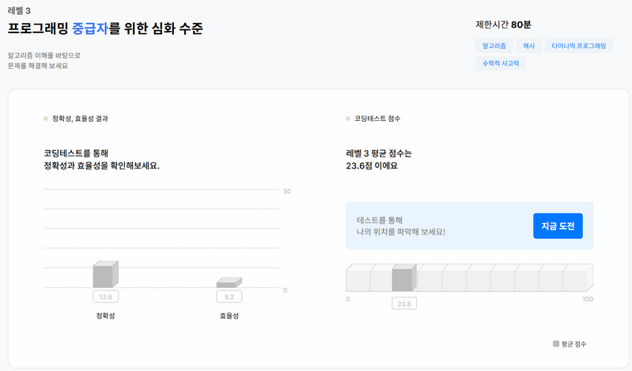

### 현재 프로그래머스 언어별 설정

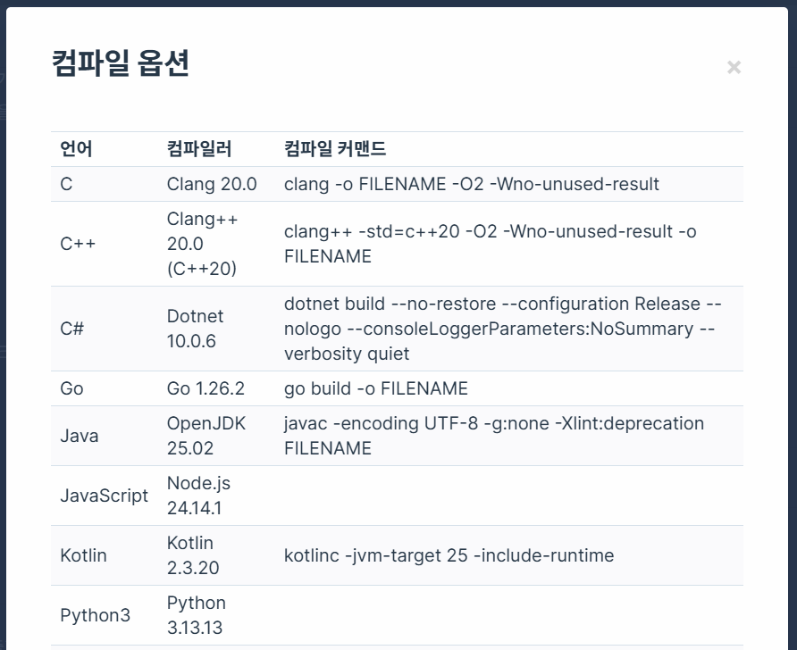

## 알고리즘 효율 분석

최악의 경우 시간복잡도 고려.

| 시간복잡도 | 최대 연산 횟수(1초) |
| :--------- | ------------------- |
| $O(N!)$    | 10                  |
| $O(2^N)$   | 20~25               |
| $O(N^3)$   | 200~300             |
| $O(N^2)$   | 3,000~5,000         |
| $O(NlogN)$ | 100만               |
| $O(N)$     | 1,000만~2,000만     |
| $O(logN)$  | 10억                |

## 코딩 테스트 필수 문법

- 빌트인 데이터 타입 - [소스](./advanced/algorithm01/app01/app01.cpp)
- STL - [소스](./advanced/algorithm01/app02/app02.cpp)

  - 특정 타입을 한정하기 않는 라이브러리
  - `컨데이터`, `알고리즘`, `반복자`
- STL 컨테이너 - C#, Java, Python에서 **Collection** 으로 호칭 [소스](./advanced/algorithm01/app03/app03.cpp)

  - 시퀀스 타입 - `벡터`, 리스트, 배열, 데크, ...
  - 연관 타입 - `셋`, `맵`, 멀티셋, 멀티맵, ...
  - 어댑터 타입 - 스택, 큐, 우선순위 큐
- STL 알고리즘 - 정렬, 검색 등 기본적인 알고리즘 [소스](./advanced/algorithm01/app04/app04.cpp)

  - `find()`, `count()`, for_each(), equal(), any_of(), ...
  - copy(), replace(), fill(), transform(), ...
  - reverse(), remove(), `unique()`, rotate(), ...
  - `sort()`, stable_sort(), partial_sort(), ...
  - `binary_search()`, lower_bound(), upper_bound(), set_union(), ...
  - `next_permutation()`, accumulate(), partial_sum(), ...
  - `max_element()`, `min_element()`, clamp(), ...
- 함수 = 메서드 - [소스](./advanced/algorithm01/app05/app05.cpp)
- 코딩 테스트 코드 구현 노하우 [소스]()

  - 조기 반환 - 함수 끝에 도달전에 반환하는 법
  - 보호 구문 - 예외처리 코드 추가하는 법(try ~ catch 아님)
  - 의미있는 변수명 사용
  - continue 잘 쓸 것 -> 속도 개선 $O(N^2)$ -> $O(N logN)$
  - 한가지 일만 하는 함수를 만들기
  - STL 적극 활용

## 코딩 테스트 완전 정복

### 배열

- 배열 선언 : arr[]
- 배열 원소 접근: arr[1]
- 배열 원소별 주소 : &arr[0]

#### 배열 시간복잡도

- arr[1] : $O(1)$
- 배열의 맨앞 원소 삽입 : $O(N)$
- 배열 중간에 원소 삽입 : $O(N)$

#### 배열 선택 고려점

- 배열 초기에 메모리 할당할 수 있는 크기 확인
- 로직 중간에 데이터 삽입/삭제 등 많은지 확인
- 배열사용 최소화 -> STL 벡터를 사용 권장

#### 코딩 테스트 연습

배열에서 두 수 뽑아서 더하기 - [소스](./advanced/algorithm02/sol05-04/sol05-04.cpp)

https://school.programmers.co.kr/learn/courses/30/lessons/68644?language=cpp

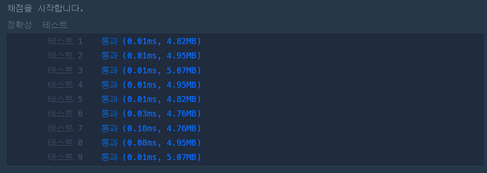

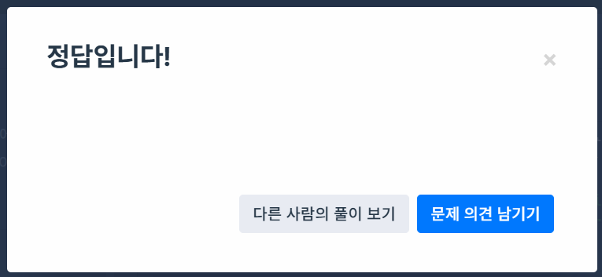

모의고사 - [소스](./advanced/algorithm02/sol05-4-04/sol05-4-04.cpp)

https://school.programmers.co.kr/learn/courses/30/lessons/42840

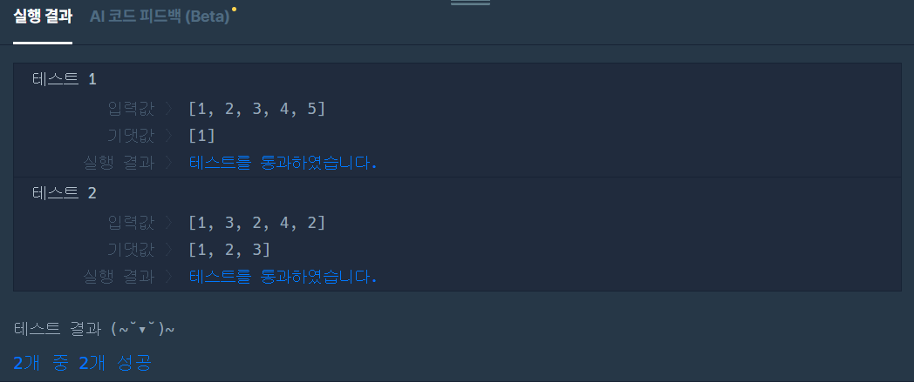

- 기본 테스트 통과

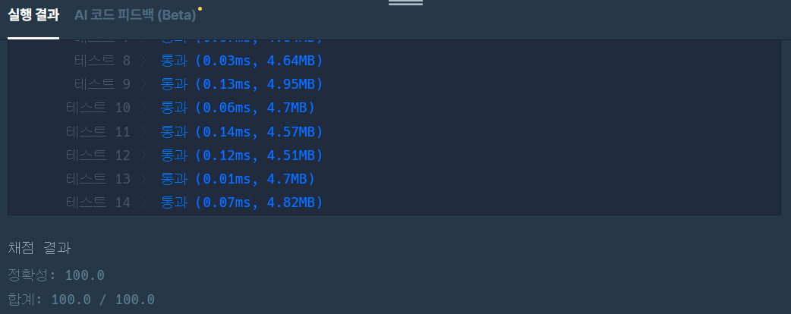

- 테스트 케이스 통과

### 스택

- LIFO. push(), pop(), is_Full(), is_Empty(), top() ...

#### 코딩 테스트 연습

괄호 짝 맞추기 - [소스](./advanced/algorithm02/sol06-3-08/sol06-3-08.cpp)

https://school.programmers.co.kr/learn/courses/30/lessons/12909?language=cpp#

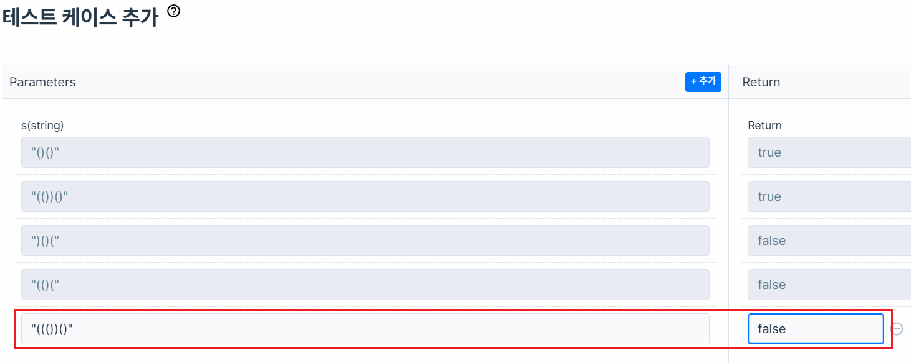

- 테스트 케이스 추가

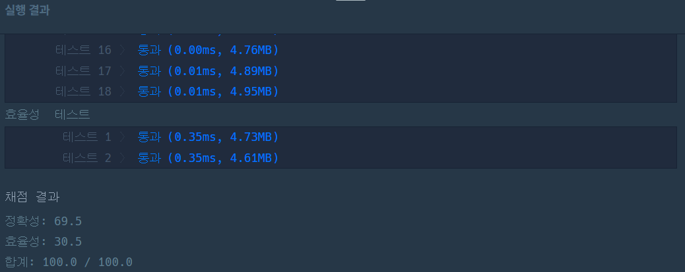

- 효율성 테스트(시간복잡도 체크)

#### 모의 테스트 연습

주식가격 - [소스](./advanced/algorithm02/sol06-4-12/sol06-4-12.cpp)

https://school.programmers.co.kr/learn/courses/30/lessons/42584

- prices [1,2,3,2,3] 일 경우 주식 가격이 떨어지지 않는 시간 result [4,3,1,1,0]

  - 인덱스 0, 가격 1의 경우 마지막까지 가격이 떨어지지 않음 -> 4초
  - 인덱스 1, 가격 2의 경우 마지막까지 2이하로 떨어지지 않음 -> 3초
  - 인덱스 2, 가격 3의 경우 1초 후에 2로 떨어짐 -> 1초
- 스택에 올라가는 가격까지 계속 push

  - 떨어지는 가격에서 스택 top 값과 비교, pop
  - 다음 top의 값이 작으면 push
  - 반복 후 들어있는 인덱스를 pop, 이전 pop의 인덱스 빼기 다음 pop 인덱스 하면 길이로 확정

표편집- [소스](./advanced/algorithm02/sol14-4-14/sol06-4-14.cpp)

https://school.programmers.co.kr/learn/courses/30/lessons/81303?language=cpp

- command : `U k`(위로 k칸), `D k`(아래로 k칸), `C`(삭제), `Z`(복구)
- 삭제를 위해서, up, down 배열이 필요
- 맨위, 맨아래 데이터 접근을 위해서 가상공간이 하나씩 필요
- 중요 로직

  - C(삭제) 시 k(삭제할 인덱스) -> `up[down[k]] = up[k]`, `down[up[k]] = down[k]` 로 변경 필요
  - 삭제한 요소 스택에 push()
  - Z(복구) 시 restore(복구할 인덱스) -> `up[down[restore]]`, `down[up[restore]]` 복구
  - 복구한 요소 스택에서 pop()
- C++ STL 스택과 다른 언어의 스택과 차이점

  - 값 조회와 삭제를 분리
  - stack.pop() 값을 할당할 수 없음!  ~~`int r = stack.pop()`~~
  - stack.top() 으로 값을 가져온 뒤
  - stack.pop() 으로 스택값을 지워야 함

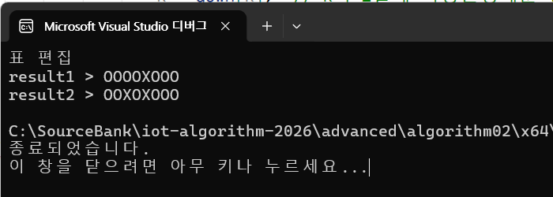

교재에서는 $O(N)$ 으로 설명. $O(N logN)$ 정도로 예상

#### 풀이 결과 예제

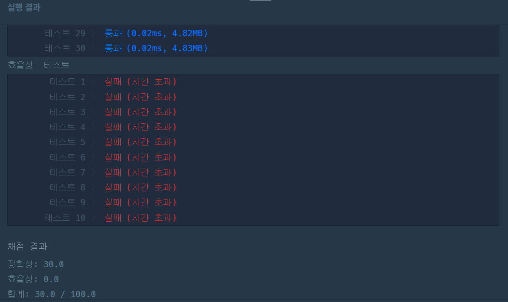

- 테스트 케이스 통과, 효율성 테스트 실패

### 큐

#### 큐 ADT

- isFull(), isEmpty(), push(), pop(), front, rear
- 스택과 유사한 함수명 사용

#### 코딩테스트 연습

요세푸스 문제 - 소스

- 1,2,3,4,5 의 경우
  - 1번째 : 3, 4, 5, 1
  - 2번째 : 5, 1, 3
  - 3번째 : 3, 5
  - 4번째 : 3

#### 모의 테스트

카드뭉치 - [소스](./advanved/algorithm02/sol07-3-16/sol07-3-16.cpp)

https://school.programmers.co.kr/learn/courses/30/lessons/159994?language=cpp

- cards1, cards2, goal을 모두 큐로 생성
- goal에 데이터가 없을때까지 반복
- cards1에 맨앞데이터와 goal 맨앞데이터가 동일하면 cards1.pop(), gial.pop()
- cards2에 맨앞데이터와 goal 맨앞데이터가 동일하면 cards2.pop(), gial.pop()
- 일치하는 cards 내용이 없으면 종료
- 반복 완료 후 goal에 데이터가 없으면 "Yes"

### 해시

키와 값의 쌍으로 저장후 빠른 데이터 검색을 제공하는 자료구조, 딕셔너리, JSON...

- **해시** : 데이터를 빠르게 찾기 위한 기술
- `딕셔너리` : 키(Key)-값(Value)로 저장하는 자료구조. 해시 테이블로 구현되어 있음

#### 해시 함수

키에 대한 인덱스를 구하는 함수

- 나눗셈법 : x % k
- 곱셈법 : `나눗셈법` 에 특수값 더 곱한 방법
- 문자열해싱 : 각 문자열 자리마다 승수를 곱한 합산. 무리하게 큰 수가 도출될 수 있음
  - 각 자리마다 나눗셈법 사용. 오버플로 방지

#### 충돌 처리

- 체이닝방법 : 해시테이블 한 행(버킷)에 연결리스트(Linked-List)로 여러값을 나열하는 방법
  - 공간활용도, 검색성능 떨어짐
- 개방주소 : 해시테이블에 빈 행까지 이동, 값을 할당해서 충돌을 방지

#### 모의 테스트

완주하지 못한 선수 - [소스](./advanced/algorithm02/sol08-5-20/sol08-5-20.cpp)

https://school.programmers.co.kr/learn/courses/30/lessons/42576?language=cpp

- 참가자 이름을 해시테이블로 추가. 키-값 : 이름-명 수
- 완주한 선수 이름을 해시테이블에서 찾아 값을 1씩 줄임
- 해시를 순회 값이 0이 아닌 키(이름)를 반환

2중 for문으로는 해결못함

메뉴 리뉴얼 - [소스](./advanced/algorithm02/sol08-5-27/sol08-5-27.cpp)

https://school.programmers.co.kr/learn/courses/30/lessons/72411

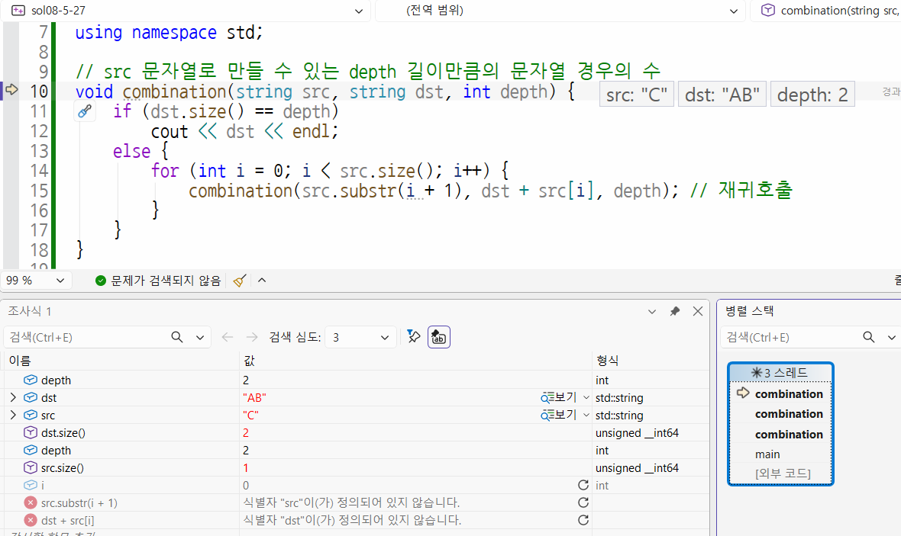

- 재귀호출 디버깅 방법
  - 재귀호출 함수 최초 호출하는 위치에 브레이크 포인트
  - 모든 스텝은 F11로 진행
  - 조사식을 최대한 활용
  - 디버깅 후 -> 디버그 메뉴 > 창 > `병렬 스택` 선택
  - 호출 스택을 사용해도 무방

### 트리

- 코딩테스트에서는 이진 트리만 알면 됨

#### 트리 구현방법

- 배열 : 구현 쉬움, 메모리공간 낭비. 인덱스 검색
- 포인터 : 구현 어려움, 메모리낭비 거의 없음
- 인접리스트 : 포인터에 비해 쉬움. 검색 어려움

#### 이진 트리 검색

- 해당 노드보다 작은 값은 왼쪽으로, 큰 값은 오른쪽으로 찾으면 됨
- $O(log N)$ 정도의 시간복잡도를 가짐

#### 몸풀기 문제

트리 순회 - [소스](./advanved/algorithm02/sol09-4-28/sol09-4-28.cpp)

- 트리 순회 : 재귀호출로 처리. 왼쪽, 오른쪽노드는 하위노드가 있을 수 있음
  - 전위 순회 : 부모노드(리턴), 왼쪽노드(재귀), 오른쪽노드(재귀) 순서로 탐색
  - 중위 순회 : 왼쪽노드(재귀), 부모노드(리턴), 오른쪽노드(재귀) 순서로 탐색
  - 후위 순회 : 왼쪽노드(재귀), 오른쪽노드(재귀), 부모노드(리턴) 순으로 탐색
  - 재귀 호출을 순서대로 변경

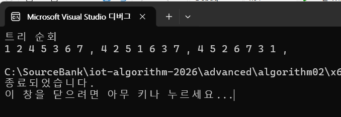

#### 모의 테스트

다단계 칫솔 판매 - [소스](./)

https://school.programmers.co.kr/learn/courses/30/lessons/77486?language=cpp

1. 판매원 - 판매원 추천인 쌍으로 맵을 생성
2. 판매원 - 판매금액 담을 맵 생성
3. 판매원(seller)와 판매갯수(amount) 변수 값을 반복
4. 금액이 0보다 크고, 판매원 추천인이 없을때까지(-) 반복하면서
5. amount * 100 금액을 10%를 뺀  금액을 판매원이 할당
6. 10% 분배금액은 추천인에게 보냄

- `제출 후 채점하기` 때 출력문 추석처리 필요. 테스트 통과 실패(출력문 갯수 초과)

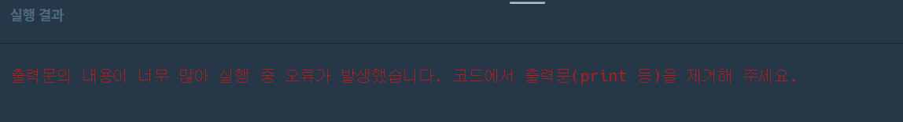

### 그래프

정점(vertex)과 간선(edge)로 구성된 비선형 데이터구조. 비방향, 방향 구조 존재

#### 그래프 코딩테스트 방법

- 그래프를 직접 만들어서 구현
- 스택, 큐 사용

#### 그래프 구현방법

- 인접 행렬 : 2차원 배열로 간선정보(연결여부, 가중치)를 담아서 사용
- 인접 리스트 : 배열과 연결리스트(정점v, 가중치w 쌍) 조합 계속 연결

#### 그래프 탐색

그래프를 사용하는 이유 -> 탐색

- 깊이 우선 탐색(DFS) - 스택, `재귀호출` > 모든 가능한 답을 찾는 백트래킹
- 너비 우선 탐색(BFS) - 큐 > 최단 경로, 네트워크 분석
  - 큐에 오름차순으로 push

#### 그래프 최단경로 구하기

- 시작 Vertext에서 마지막 Vertex까지의 최단경로 : 간선의 수 또는 가중치 합의 최소

#### 다익스트라 알고리즘

- 양의 가중치로 간선의 구성된 그래프의 최단거리(최소비용)구하는 알고리즘

1. 시작노드 설정, 특정노드까지 최소비용 저장할 공간, 직전노드 저장공간 구성
2. 시작노드는 0, 나머지 공간을 모두 무한대(INF)로 지정
3. 방문할 수 있는 노드까지의 가중치와 현재 가중치를 비교해서 더 작은 가중치를 최소비용에 저장
4. 방문알 노드가 없을때까지 반복

#### 벨만-포드 알고리즘

- 음의 가중치도 존재하는 간선으로 구성된 그래프의 최단거리를 구하는 알고리즘

1. 초기화는 다익스트라와 동일
2. 노드개수 - 1 반복 : 노드 갯수보다 많은 간선으로 연결되는 최소비용은 없음

- `간선의 수만큼 전부 최소비용 파악`
- 시작노드로 갈수 있는 각 노드에 최소비용 확인해서 이전값(INF)과 갱신

3. 모든 간선으로 가는 경우를 전부 계산, 최소비용이 다시 갱신되면 `음의 순환` 존재하고 `문제를 풀 수 없음`, 음의 순환이 존재하지 않으면 문제 해결할 수 있음

- 노드 5개 간선이 8개 : 총 네번 반복, 모든 간선의 수 8개의 최소비용 파악
- 음의 순환 파악으로 간선 8개의 최소비용 다시 계산

#### 몸풀기 문제

깊이우선탐색 - [소스](./advanced/algorithm02/sol11-4-36/sol11-4-36.cpp)

- 재귀호출로 구현

너비우선탐색 - [소스](./advanced/algorithm02/sol11-4-37/sol11-4-37.cpp)

- 큐로 구현

다익스트라 알고리즘 - [소스](./advanced/algorithm02/sol11-4-38/sol11-4-38.cpp)

- const int INF = numeric_limits<int>::max();  // 21억
- 전체 그래프를 무한대로 초기화
- 방문리스트 필요
- 가중치 결과 리스트도 무한대로 초기화
- 새로 구한 최소거리값이 이전값과 비교시 작으면 업데이트
- 음의 순환이 없는 음수 가중치가 존재하는 그래프도 결과 확인됨

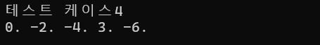

벨만-포드 알고리즘 - [소스](./advanced/algorithm02/sol11-4-39/sol11-4-39.cpp)

- 다익스트라와 동일한 방식
- 반복을 한번 더해서 최소비용이 작아지는 경우가 발생하면 `음의 순환`

### 백트래킹

- 그래프에서 DFS, BFS는 모두 완전탐색 > 비효율적
- 미로찾기

#### 유망함수

1. 유효한 답의 집합 정의
2. 위 단계에 정의한 집합을 그래프로 표현
3. `유망함수` 정의
4. 백트래킹 알고리즘으로 해답찾기

#### 백트래킹 예제

- 부분집합 합
- N-퀸 문제

#### 몸풀기 문제

- 1부터 N까지 숫자중 합이 10되는 조합 - [소스](./advanced/algorithm02/sol12-2-47/sol12-2-47.cpp)
- 재귀호출 > $O(N!)$ 시간복잡도

### 코딩 테스트 준비물

- 주최 기업마다 준비물이 다름
- PC를 제공여부(보통 노트북)
- 종이 펜 허용

### 코딩 테스트 저자의 글

- 기본 지식만으로 통과하기 어렵다
- 100문제 풀이